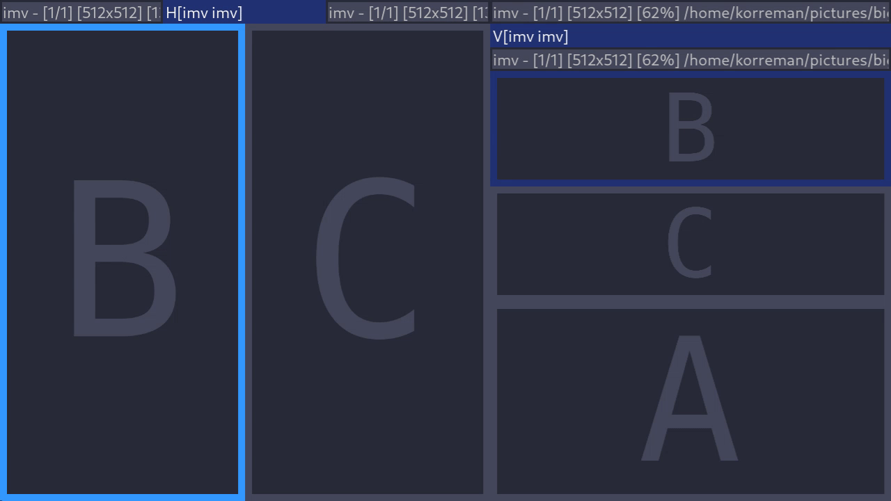

# `sway-overfocus`

Alternative basic focus movement for the sway and i3 window managers.

The primary goal of this program is to
create one set of keybinds exclusively for cycling through tabs/stacks,
and another set exclusively for navigating between splits.
This is accomplished by providing custom focus commands
that target only specific layouts.
The result is that switching focus generally can be performed in one action
rather than some sequence of `focus parent` and `focus [direction]` actions.

## Installation instructions

The project compiles to a standalone binary
that interfaces with `sway` or `i3` over IPC.

Download a [release](https://github.com/korreman/sway-overfocus/releases)
or build with `cargo build --release` using `rustc` v1.58 or higher.
Copy the binary (located in `./target/release` when building)
to a location in your `$PATH`,
fx. `~/.local/bin`.
Then insert/replace keybinds to run `exec sway-overfocus ...` commands
in your sway configuration.

See the [usage](usage.md) page for details on constructing focus commands.
The following config section is a good starting point,
but commands can be configured granularly to suit your needs.

    bindsym $mod+h exec sway-overfocus split-lt float-lt output-ls
    bindsym $mod+j exec sway-overfocus split-dt float-dt output-ds
    bindsym $mod+k exec sway-overfocus split-ut float-ut output-us
    bindsym $mod+l exec sway-overfocus split-rt float-rt output-rs
    bindsym $mod+Tab exec sway-overfocus group-rw group-dw
    bindsym $mod+Shift+Tab exec sway-overfocus group-lw group-uw
